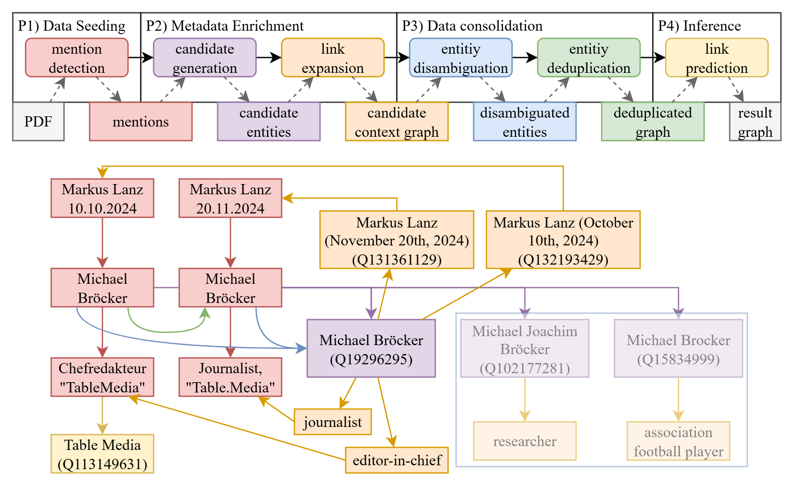

# Lanz-Mining But FAIR

This repository contains a notebook-first workflow for extracting, enriching, disambiguating, deduplicating, and inferring structured talk show knowledge.

The workflow is phase-based and human-in-the-loop where precision matters most:

1. mention detection
2. candidate generation
3. entity disambiguation (manual decisions)
4. entity deduplication (manual decisions)
5. link prediction

## Approach




The documentation can be found here:
* [documentation/README.md](documentation/README.md)

To jump right into the Implemtation and Workflow Notebooks, see
* [documentation/workflow.md](documentation/workflow.md)

## Background

This repository continues prior work from LanzMining, Lanz Mining but FAIR, and related linked-data/media analyses.

- [documentation/background.md](documentation/background.md)

## Citation

If you cite the approach, please reference:

```
@article{remmo_lanzmining_2026,
	title = {{LanzMining} aber {FAIR}: {Empirische} {Fragen} zur {Medienlandschaft} mittels {FAIRer} {Talkshow}-{Daten} beantworten},
	shorttitle = {{LanzMining} aber {FAIR}},
	url = {https://repo.uni-hannover.de/handle/123456789/20906},
	doi = {10.15488/20751},
	language = {ger},
	author = {Remmo, Omar Imad},
	publisher = {Hannover : Institutionelles Repositorium der Leibniz Universität Hannover},
	year = {2026},
	month = mar,
}
```
