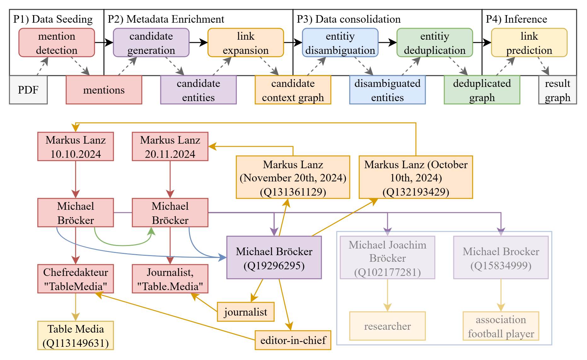

# SpeakerMining

A notebook-first pipeline for extracting, enriching, disambiguating, and analyzing structured knowledge from talk shows and podcasts.

## Pipeline Overview

The workflow is phase-based and human-in-the-loop where precision matters most:

| Phase | Step | Description |
|---|---|---|
| Pre-phase | 10 | Text extraction (PDF → structured text, optional) |
| 1 | 11 | Mention detection (episodes, seasons, guests, topics) |
| 2 | 20–22 | Candidate generation (Wikibase, Wikidata, fernsehserien.de) |
| 3 | 31 | Entity disambiguation (automated + manual via OpenRefine) |
| 3 | 32 | Entity deduplication (automated + manual validation) |
| 4 | 40 | Link prediction (placeholder) |
| 5 | 50 | Analysis and visualization |



## Quick Start

```bash
# Clone the repository
git clone https://github.com/borgnetzwerk/speaker-mining.git
cd speaker-mining

# Create and activate a virtual environment
python -m venv .venv
.venv\Scripts\activate        # Windows
# source .venv/bin/activate   # Linux/macOS

# Install dependencies
pip install -r requirements.txt
```

Notebooks live in `speakermining/src/process/notebooks/`. Run them in the order shown in [`documentation/workflow.md`](documentation/workflow.md).

> **Note on imports:** Notebooks configure `sys.path` in their setup cell to find the `speakermining/src` modules. No package install is required for normal operation.

## Documentation

- [`documentation/workflow.md`](documentation/workflow.md) — execution order, phase ownership rules
- [`documentation/repository-overview.md`](documentation/repository-overview.md) — architecture and module map
- [`documentation/contracts.md`](documentation/contracts.md) — output file schemas
- [`documentation/coding-principles.md`](documentation/coding-principles.md) — engineering practices
- [`documentation/findings.md`](documentation/findings.md) — aggregated analysis and evidence

## Data

Input data and pipeline outputs are stored under `data/` and are excluded from version control (see `.gitignore`). The configuration files in `data/00_setup/` that control pipeline behavior (show registry, Wikidata class definitions, property mappings) are tracked.


## Citation

If you cite the approach, please reference:

```bibtex
@article{remmo_lanzmining_2026,
	title = {{LanzMining} aber {FAIR}: {Empirische} {Fragen} zur {Medienlandschaft} mittels {FAIRer} {Talkshow}-{Daten} beantworten},
	shorttitle = {{LanzMining} aber {FAIR}},
	url = {https://repo.uni-hannover.de/handle/123456789/20906},
	doi = {10.15488/20751},
	language = {ger},
	author = {Remmo, Omar Imad},
	publisher = {Hannover : Institutionelles Repositorium der Leibniz Universität Hannover},
	year = {2026},
	month = mar,
}
```

## License

MIT — see [LICENSE](LICENSE).
