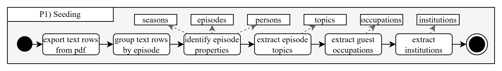

# Speaker Mining Documentation

## Approach
The project extracts structured talk show knowledge from archival PDF material, enriches entities with linked-data candidates, consolidates identities, and prepares graph-ready CSV outputs for Wikibase and downstream analysis.

The workflow consists of 6 steps in 4 phases:

1.1 mention detection
2.1 candidate generation
2.2 link expansion
3.1 entity disambiguation
3.2 entity deduplication
4.1 link prediction

## Steps

### Phase 1: Data Seeding
**Goal:** Convert source documents into initial structured entities.

**Steps:**
1. export text rows from PDF
2. group text rows by episode
3. identify episode properties
4. extract episode topics
5. extract guest occupations
6. extract institutions

**Outputs (seed entities):**
* seasons
* episodes
* topics
* persons
* institutions
* occupations

**Implementation:** [speakermining\src\process\mention_detection.py](mention_detection.py)

## Phase P2: Candidate Generation
**Goal:** Generate candidate knowledge-graph entities for mentions.

**Steps:**
1. search for candidates
2. expand in- and outlinks
3. repeat step 2 whenever it reveals new candidates

**Outputs (metadata expansion):**
- candidate entity set with expanded context graph

**Implementation:** [speakermining\src\process\candidate_generation.py](candidate_generation.py)

## Phase 3: Data Consolidation
**Goal:** Resolve identities and merge duplicates into a clean entity graph.

**Steps:**
- quantify candidate-entity similarity
- select candidate with HITL (human in the loop)
- quantify entity-entity similarity
- merge entities with HITL
- ingest candidate data

Outputs:

- disambiguated entities
- deduplicated graph

Important characteristic:

- Human validation is an explicit part of the decision process.

## Phase 4: Inference

Status in diagrams: conceptual placeholder.

Intent:

- infer additional links/facts after consolidation
- produce more complete result graphs for query and analytics

## Diagram Inventory

The source file contains multiple views:

- Approach: End-to-end conceptual flow
- Ps: Process summary
- P1: Data seeding
- P2: Candidate generation
- P3: Data consolidation
- P4: Inference (currently conceptual)
- Meta-Approach: Multi-source alignment and Wikibase update strategy
- Class Diagram: Entity and property structure
- Event Modelling: Expanded process and interactions

Reference files:

- [SpeakerMining_V3-P3.drawio.pdf](SpeakerMining_V3-P3.drawio.pdf)
- [SpeakerMining_V3-Ps.drawio.pdf](SpeakerMining_V3-Ps.drawio.pdf)

## Data Model Highlights (Class Diagram)

The class diagram models item-like entities with core metadata and graph properties.

Typical fields include:

- reference
- label
- description
- alias
- wikibase ID
- wikidata ID
- instance of

Episode/season-oriented properties include:

- publication date
- talk show guest
- season
- part of series
- genre
- presenter
- original broadcaster
- country of origin
- original language of film or TV show

The diagram also indicates qualifier/reference-capable property structures (triple-like representation), aligning with Wikibase statement semantics.

## Workspace Mapping

## Main Inputs

- Text/PDF-derived source material: [textfiles](textfiles)
- Additional datasets: [Arrrrrmin Data](Arrrrrmin%20Data)
- SPARQL snapshots and imported CSVs: [data/01_input](data/01_input)

## Main Outputs

- Persons CSV: [person/Personen.csv](person/Personen.csv)
- Seasons CSV: [seasons/Staffeln.csv](seasons/Staffeln.csv)
- Episodes CSV (current dataset location): [data/01_input/items/Episoden.csv](data/01_input/items/Episoden.csv)
- Analytical outputs: [output](output)

## Configuration and Integration

- Wikibase/OpenRefine configuration: [manifest.json](manifest.json)
- OpenRefine reconciliation assets: [openrefine-wikibase](openrefine-wikibase)
- Caddy setup: [Caddyfile/Caddyfile](Caddyfile/Caddyfile)

## Execution Notes

Current extraction and CSV generation logic is implemented in the notebook [lanz-mining-but-fair.ipynb](lanz-mining-but-fair.ipynb), including:

- PDF text extraction and episode grouping
- episode cleaning and duplicate removal heuristics
- guest/person extraction
- episode and season table generation
- CSV export for downstream graph ingestion

Minimal Python dependencies observed in notebook:

- pdfplumber
- pypdf
- pandas
- matplotlib

## Meta-Approach Context

The Meta-Approach diagram extends this pipeline to multi-source ingestion and alignment:

- extract items from a primary source
- search similar items across different databases
- align items from different sources
- deduplicate aligned records
- update Wikibase

This supports a FAIR-oriented strategy where multiple CSV sets can be reconciled into one consolidated knowledge base.

## Known Gaps and Next Steps

- P4 inference is not yet specified in detail.
- Candidate generation and consolidation are strongly modeled in diagrams, but parts may still be semi-manual or notebook-centric in implementation.
- A script-based, reproducible pipeline (outside notebook execution order) would improve operational robustness.

## Quick Orientation

If you are new to the project, review in this order:

1. [documentation/SpeakerMining_V3.drawio.xml](documentation/SpeakerMining_V3.drawio.xml)
2. [documentation/README.md](documentation/README.md)
3. [lanz-mining-but-fair.ipynb](lanz-mining-but-fair.ipynb)
4. [manifest.json](manifest.json)
5. CSV outputs under [data](data), [person](person), and [seasons](seasons)
