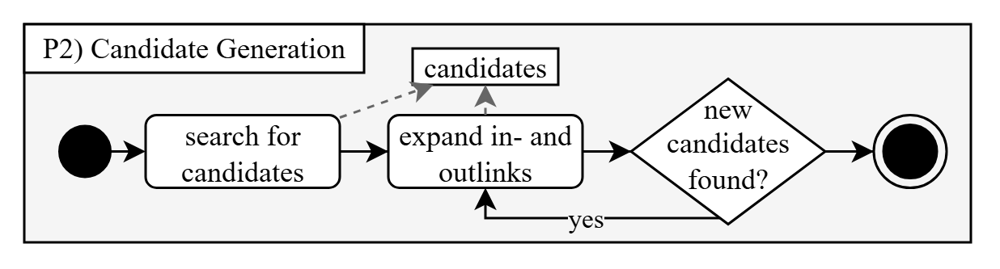
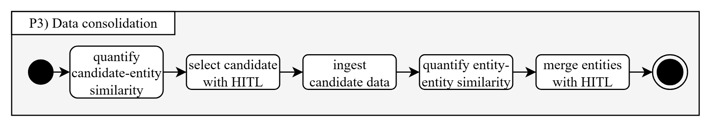

# Speaker Mining Documentation

## Approach
The project extracts structured talk show knowledge from archival PDF material, enriches entities with linked-data candidates, consolidates identities, and prepares graph-ready CSV outputs for Wikibase and downstream analysis.

The workflow consists of 6 steps in 4 phases:

1.1 mention detection
2.1 candidate generation
2.2 link expansion
3.1 entity disambiguation
3.2 entity deduplication
4.1 link prediction

## Steps

### Phase 1: Data Seeding
**Goal:** Convert source documents into initial structured entities.

**Steps:**
1. export text rows from PDF
2. group text rows by episode
3. identify episode properties
4. extract episode topics
5. extract guest occupations
6. extract institutions

**Outputs (seed entities):**
* seasons
* episodes
* topics
* persons
* institutions
* occupations

**Implementation:** [speakermining\src\process\mention_detection.py](mention_detection.py)

## Phase P2: Candidate Generation
**Goal:** Generate candidate knowledge-graph entities for mentions.

**Steps:**
1. search for candidates
2. expand in- and outlinks
3. repeat step 2 whenever it reveals new candidates

**Outputs (metadata expansion):**
- candidate entity set with expanded context graph

**Implementation:** [speakermining\src\process\candidate_generation.py](candidate_generation.py)

## Phase 3: Data Consolidation
**Goal:** Resolve identities and merge duplicates into a clean entity graph.

**Steps:**
1. quantify candidate-entity similarity
2. select candidate with HITL (human in the loop)
3. quantify entity-entity similarity
4. merge entities with HITL
5. ingest candidate data

**Outputs (data consolidation):**
* disambiguated entities
* deduplicated graph

## Phase 4: Inference

WIP:
* infer additional links/facts after consolidation
* produce more complete result graphs for query and analytics

## Data Model
The class diagram models item-like entities with core metadata and graph properties.

Typical fields include:
* reference
* label
* description
* alias
* wikibase ID
* wikidata ID
* instance of

Episode properties include:
* publication date
* talk show guest
* season
* part of series
* genre
* presenter
* original broadcaster
* country of origin
* original language of film or TV show

The diagram also indicates qualifier/reference-capable property structures (triple-like representation), aligning with Wikibase statement semantics.

## Workspace Mapping

### Main Inputs

WIP

### Main Outputs

WIP

### Configuration and Integration

* Wikibase/OpenRefine configuration: [manifest.json](speakermining/src/config/manifest.json)
* OpenRefine reconciliation assets: [openrefine-wikibase](openrefine-wikibase)
* Caddy setup: [Caddyfile/Caddyfile](speakermining/src/config/Caddyfile)

## Future Work

* P4 inference is not yet specified in detail.
* Candidate generation and consolidation are strongly modeled in diagrams, but parts may still be semi-manual or notebook-centric in implementation.
* A script-based, reproducible pipeline (outside notebook execution order) would improve operational robustness.

### Code Rework:
* Extracting from PDF seems similar to Candidate generation. Seperating these extraction method into "primary" and "secondary" does not seem right - realistically, both are "take source and extract items". If they can be grouped, this might be desirable.

## Further Navigation

WIP